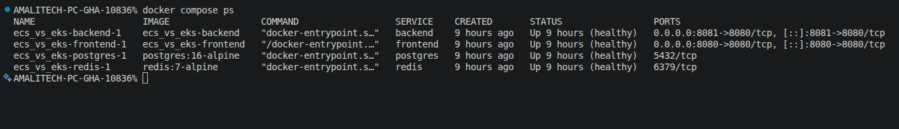
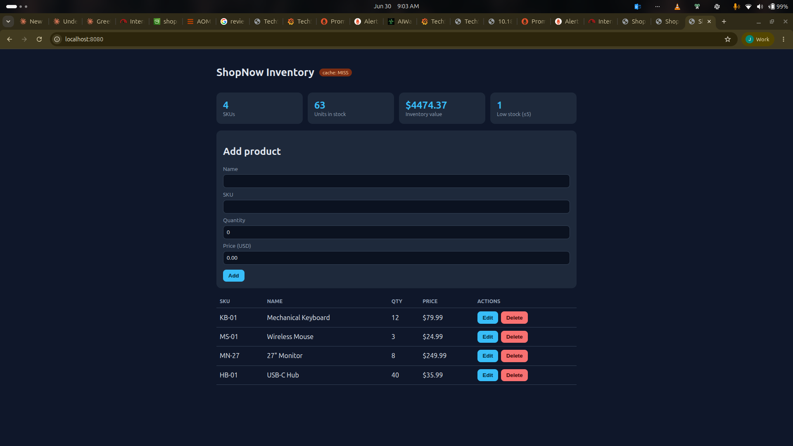
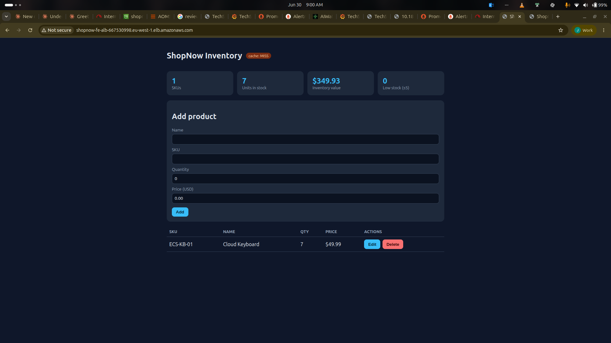
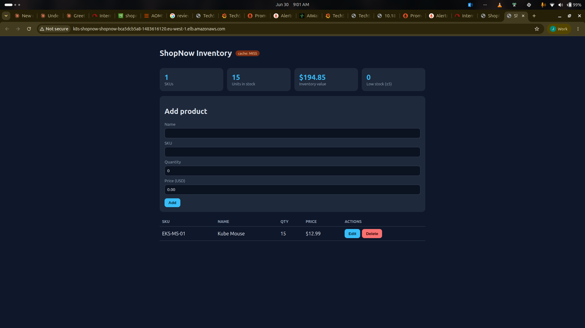
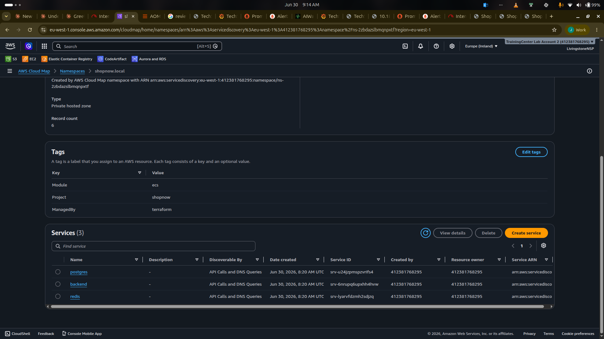
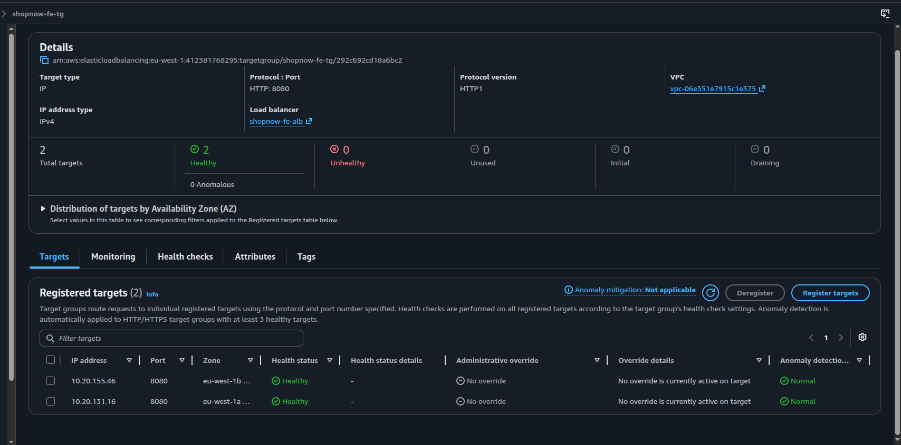
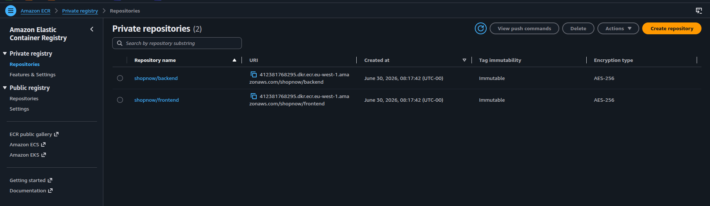
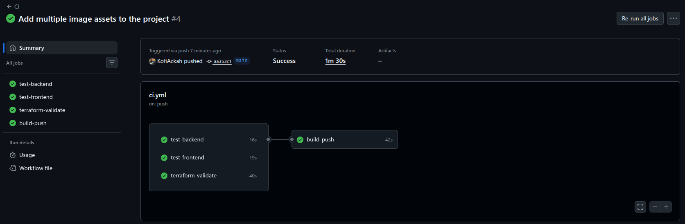
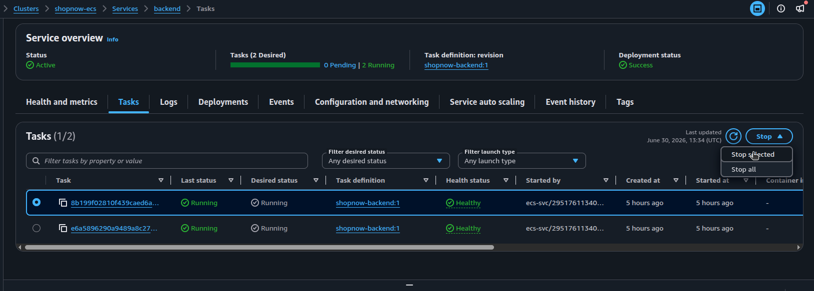

# ShopNow — Poly-Orchestrator Benchmark: AWS ECS (Fargate) vs Amazon EKS (Fargate)

> **DevOps lab — “The Poly-Orchestrator Challenge.”** As the DevOps engineer for *ShopNow* (a 3-tier
> e-commerce startup), benchmark **ECS Fargate** against **EKS Fargate** by deploying the **same**
> application to both, with service discovery, load balancing, and demonstrated resiliency.

**Author:** Kofi Ackah · **Region:** `eu-west-1` · **Repo:** `KofiAckah/ECS-EKS_benchmark`

---

## 0. The one idea that drives everything

> **Build once, deploy the same image digest to both platforms.** A single set of immutable images is
> pushed to ECR and deployed *unchanged* to ECS and EKS. The **orchestrator is the only variable**, so
> the comparison is fair. Every environment-specific value (DB host, Redis URL, backend discovery name,
> secrets) is injected at **runtime** — never baked into an image.

**Proof — identical digest on both platforms:**
```
EKS pod : .../shopnow/backend@sha256:eba54a0ea98310b43c87e74d762772512c6bd41db2e0d38299b8f279489f8080
ECS task:                      sha256:eba54a0ea98310b43c87e74d762772512c6bd41db2e0d38299b8f279489f8080
```

---

## 1. How this maps to the grading rubric (`Requirements.txt`)

| Rubric criterion | Where it's demonstrated |
|---|---|
| **Code Quality** | Clean, layered backend (`config`/`db`/`cache`/`repo`/`routes`/`app`), 12-factor config, ESLint clean on both apps, small focused modules. `backend/src/`, `frontend/src/` |
| **Security Practices** | Non-root containers, secrets in **Secrets Manager** (ECS) / K8s Secret (EKS) — none in git, **GitHub OIDC → IAM** (no static keys), least-privilege SGs & IAM, private subnets, TLS-only state bucket, ECR scan-on-push. See [docs/SECURITY.md](docs/SECURITY.md) |
| **Testing** | Backend Jest unit + supertest API tests; frontend Vitest + React Testing Library; readiness/liveness probes; Docker Compose verification. `backend/tests/`, `frontend/src/App.test.jsx` |
| **Tool Dexterity** | Docker, Terraform (modular, remote state), Kubernetes + kustomize, Helm (ALB controller, metrics-server), AWS CLI, GitHub Actions |
| **Solution Design** | 3-tier app, identical images to two orchestrators, real service discovery (Cloud Map vs ClusterIP DNS), ALB load balancing, autoscaling, health-based routing. [docs/ARCHITECTURE.md](docs/ARCHITECTURE.md) |
| **Cost Optimization** | Single NAT GW, VPC endpoints (ECR/S3/Logs/STS), Fargate-on-both, ECR lifecycle policies, short log retention, one-click teardown. [docs/COST.md](docs/COST.md) |
| **DevOps Practices** | IaC for 100% of infra, CI (lint→test→validate→build→push) via OIDC, manual gated deploy, teardown workflow, immutable SHA tags, Git history. `.github/workflows/`, `terraform/` |
| **Structure, Quality & Documentation** | This README + 7 focused docs + architecture diagram + evidence screenshots + clear repo layout |
| **Problem Solving Approach** | Documented & solved real EKS-Fargate footguns (CoreDNS-on-Fargate, ALB `target-type: ip`, Nginx-resolver-needs-FQDN). [docs/LESSONS_LEARNED.md](docs/LESSONS_LEARNED.md) |

---

## 2. Architecture

```
                          Internet
                              │  HTTP :80
                   ┌──────────▼───────────┐
                   │ Application Load Bal. │   (one per platform)
                   └──────────┬───────────┘
                              │  → :8080
                   ┌──────────▼───────────┐
                   │ Frontend: Nginx +     │   serves React SPA AND
                   │ built React assets    │   reverse-proxies /api/*
                   └──────────┬───────────┘
                              │  internal service discovery
       ECS: backend.shopnow.local (Cloud Map)  │  EKS: backend (ClusterIP DNS)
                   ┌──────────▼───────────┐
                   │ Backend: Express API  │   CRUD + Redis cache-aside
                   └─────┬───────────┬─────┘
                ┌────────▼───┐   ┌───▼──────────┐
                │ PostgreSQL │   │    Redis     │   (in-cluster; prod → RDS/ElastiCache)
                └────────────┘   └──────────────┘
```

**Service-discovery seam (the key design choice).** A pure React SPA would have the *browser* call the
API, exercising no internal discovery. Instead the **frontend container runs Nginx**, which serves the
SPA and reverse-proxies `/api/*` to the backend by an internal name supplied at runtime:

| | ECS Fargate | EKS Fargate |
|---|---|---|
| Mechanism | AWS Cloud Map private DNS | Kubernetes Service (ClusterIP) + CoreDNS |
| Backend name | `backend.shopnow.local` | `backend.shopnow.svc.cluster.local` |

Full detail: [docs/ARCHITECTURE.md](docs/ARCHITECTURE.md).

---

## 3. Tech stack
React (Vite) · Node.js + Express · PostgreSQL · Redis · Nginx · Docker · Terraform · AWS **ECS Fargate** ·
AWS **EKS Fargate** · Cloud Map · ALB · ECR · Secrets Manager · IAM/IRSA · GitHub Actions (OIDC) · Helm · kustomize.

---

## 4. Repository layout

```
.
├── backend/                # Express API: products CRUD, Redis cache-aside, /healthz + /readyz
│   ├── src/                # config, db, cache, products.repo, products.routes, app, server
│   └── tests/              # unit (validation) + integration (supertest API)
├── frontend/               # React + Nginx; nginx/default.conf.template proxies /api
├── docker-compose.yml      # local 3-tier stack
├── terraform/
│   ├── bootstrap/          # S3 remote-state bucket (TLS-only, versioned, encrypted)
│   ├── network/            # VPC, 2×public + 2×private subnets, 1 NAT GW, VPC endpoints
│   ├── ecr/                # 2 repos (scan-on-push, immutable, lifecycle)
│   ├── ecs/                # cluster, task defs, services, Cloud Map, ALB, autoscaling, secrets
│   ├── eks/                # cluster, Fargate profiles, IRSA, ALB controller, metrics-server
│   └── github-oidc/        # OIDC provider + scoped CI role (no static keys)
├── kubernetes/             # Namespace, ConfigMap, Secret, Deployments, Services, Ingress, HPA (+ kustomize)
├── .github/workflows/      # ci.yml, deploy.yml (manual), teardown.yml
├── docs/                   # architecture, deployment, comparison, cost, security, resiliency, lessons
└── assets/                 # evidence screenshots
```

---

## 5. Run it locally
```bash
cp .env.example .env            # set a local DB password
docker compose up --build       # frontend :8080, backend :8081
# verify:
curl localhost:8081/readyz                                   # {"status":"ready", ...}
curl -X POST localhost:8080/api/products -H 'Content-Type: application/json' \
     -d '{"name":"Keyboard","sku":"KB-01","quantity":3,"priceCents":1999}'
curl -D - localhost:8080/api/products -o /dev/null | grep -i x-cache   # MISS then HIT
```
Tests: `cd backend && npm ci && npm test` · `cd frontend && npm ci && npm test`.

---

## 6. Deploy to AWS (summary — full runbook in [docs/DEPLOYMENT.md](docs/DEPLOYMENT.md))
```bash
# state bucket: shopnow-tfstate-412381768295-euw1 (eu-west-1, versioned)
cp terraform/backend.hcl.example terraform/backend.hcl

terraform -chdir=terraform/network init -backend-config=../backend.hcl && terraform -chdir=terraform/network apply
terraform -chdir=terraform/ecr    init -backend-config=../backend.hcl && terraform -chdir=terraform/ecr    apply

# build & push the SAME tag to both platforms
TAG=$(git rev-parse --short HEAD); REGISTRY=412381768295.dkr.ecr.eu-west-1.amazonaws.com
aws ecr get-login-password --region eu-west-1 | docker login --username AWS --password-stdin $REGISTRY
for s in backend frontend; do docker build --platform linux/amd64 -t $REGISTRY/shopnow/$s:$TAG ./$s && docker push $REGISTRY/shopnow/$s:$TAG; done

terraform -chdir=terraform/ecs init -backend-config=../backend.hcl && terraform -chdir=terraform/ecs apply -var state_bucket=shopnow-tfstate-412381768295-euw1 -var image_tag=$TAG
terraform -chdir=terraform/eks init -backend-config=../backend.hcl && terraform -chdir=terraform/eks apply -var state_bucket=shopnow-tfstate-412381768295-euw1
aws eks update-kubeconfig --name shopnow-eks --region eu-west-1
cd kubernetes && kustomize edit set image shopnow/backend=$REGISTRY/shopnow/backend:$TAG shopnow/frontend=$REGISTRY/shopnow/frontend:$TAG && kubectl apply -k .
```

---

## 7. CI/CD (GitHub Actions, OIDC — no static keys)
- **`ci.yml`** (on push/PR): `test-backend` → `test-frontend` → `terraform-validate` → `build-push` (immutable SHA tag to ECR). Auth via **GitHub OIDC → IAM role**.
- **`deploy.yml`** (manual, `workflow_dispatch`): rolls a chosen tag to ECS (Terraform) and EKS (kustomize + kubectl). Kept manual so deploys are deliberate.
- **`teardown.yml`** (manual): `terraform destroy` in reverse order — cost guard.

GitHub repo config: secret `AWS_ROLE_ARN`, vars `AWS_REGION=eu-west-1`, `TF_STATE_BUCKET=shopnow-tfstate-412381768295-euw1`.

---

## 8. Resiliency (self-healing on both platforms)
**ECS** — stop a task; the service scheduler relaunches it to desired count:
```bash
TASK=$(aws ecs list-tasks --cluster shopnow-ecs --service-name backend --region eu-west-1 --query 'taskArns[0]' --output text)
aws ecs stop-task --cluster shopnow-ecs --task $TASK --region eu-west-1
```
**EKS** — delete a pod; the ReplicaSet recreates it:
```bash
kubectl get pods -n shopnow -w     # terminal 1
kubectl delete pod -n shopnow $(kubectl get pod -n shopnow -l app=backend -o jsonpath='{.items[0].metadata.name}')   # terminal 2
```
Detail & how-to: [docs/RESILIENCY.md](docs/RESILIENCY.md).

---

## 9. Evidence (screenshots)

| Local & app | |
|---|---|
| Local stack healthy (`docker compose ps`) |  |
| Local app (localhost:8080) |  |
| **ECS** app via ALB |  |
| **EKS** app via Ingress ALB |  |

| Infrastructure | |
|---|---|
| Cloud Map service discovery (`shopnow.local`) |  |
| ALB target group — healthy targets |  |
| ECR repositories (immutable, scan-on-push) |  |

| DevOps & resiliency | |
|---|---|
| CI pipeline green |  |
| ECS resiliency — stopping a task |  |

---

## 10. Documentation index
- [Architecture](docs/ARCHITECTURE.md) · [Deployment runbook](docs/DEPLOYMENT.md)
- [ECS vs EKS comparison](docs/COMPARISON.md) · [Cost analysis](docs/COST.md)
- [Security](docs/SECURITY.md) · [Resiliency](docs/RESILIENCY.md) · [Lessons learned](docs/LESSONS_LEARNED.md)

---

## 11. ECS vs EKS — verdict (full version in [docs/COMPARISON.md](docs/COMPARISON.md))
- **ECS Fargate**: fastest to deploy, lowest ops, **no control-plane cost** — best for a small startup like ShopNow.
- **EKS Fargate**: richer ecosystem & portability, but ~$72/mo control plane + more setup (ALB controller, IRSA, CoreDNS-on-Fargate).
- Holding compute constant (Fargate on both) isolated the orchestrator as the only variable — exactly what a benchmark should do.

---

## 12. Cleanup (stop the bill)
The EKS control plane, NAT Gateway, and ALBs bill continuously. Tear down in order (Ingress first so the
ALB controller removes its load balancer before the VPC):
```bash
kubectl delete -k kubernetes/
terraform -chdir=terraform/eks destroy -var state_bucket=shopnow-tfstate-412381768295-euw1
terraform -chdir=terraform/ecs destroy -var state_bucket=shopnow-tfstate-412381768295-euw1
terraform -chdir=terraform/ecr destroy
terraform -chdir=terraform/network destroy
```
