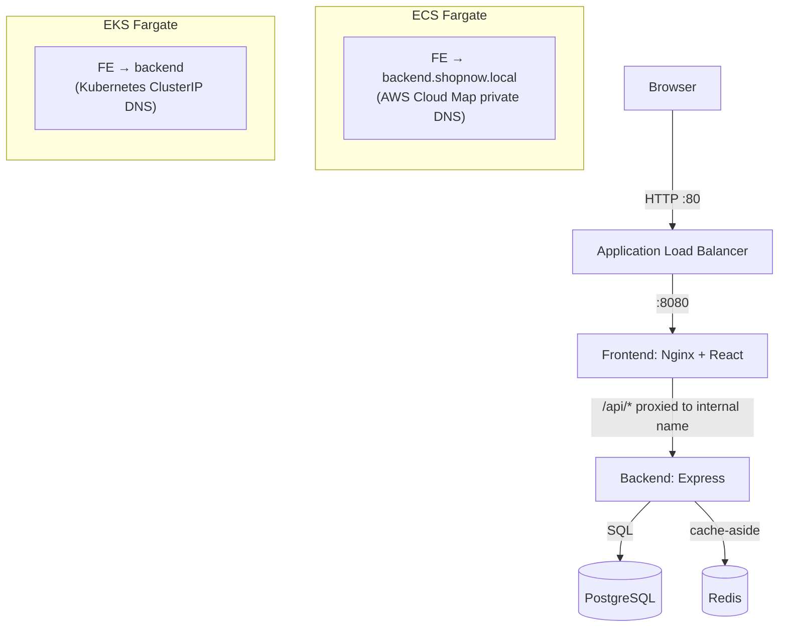

# Architecture

## Components

| Tier | Tech | Container | Notes |
|------|------|-----------|-------|
| Frontend | React (Vite) + Nginx | `frontend` | Serves the static SPA; reverse-proxies `/api/*` to the backend |
| Backend | Node.js + Express | `backend` | REST CRUD; Redis cache-aside on the product listing; `/healthz` + `/readyz` |
| Database | PostgreSQL 16 | `postgres` | Ephemeral in both platforms (prod → RDS) |
| Cache | Redis 7 | `redis` | Caches `GET /api/products`; invalidated on writes |

## Request flow

## The service-discovery seam

The single most important design choice: a **pure React SPA would not exercise internal service
discovery** (the browser would call a public API directly). Instead, the **frontend container runs
Nginx**, which:

1. Serves the built React assets, and
2. Reverse-proxies `/api/*` to the backend over an **internal** name.

That internal name is the only thing that differs between platforms, and it is injected at runtime
(env var → `envsubst` into the Nginx config), so the **same image** runs in both:

| | ECS Fargate | EKS Fargate |
|---|---|---|
| Mechanism | AWS Cloud Map (private DNS namespace) | Kubernetes Service (ClusterIP) + CoreDNS |
| Backend name | `backend.shopnow.local` | `backend` (`backend.shopnow.svc.cluster.local`) |
| Registration | ECS service `service_registries` | `kind: Service` selector |
| Re-resolution | Nginx `resolver` re-queries on a short TTL (task IPs change) | ClusterIP is stable; kube-proxy handles pod churn |

## Network topology

- **VPC** `10.20.0.0/16`, 2 AZs.
- **Public subnets** — ALBs only.
- **Private subnets** — all Fargate tasks/pods, Postgres, Redis. No public IPs.
- **1 NAT Gateway** — egress for private subnets (cost guardrail: single, not per-AZ).
- **VPC endpoints** — ECR (api + dkr), S3 (gateway), CloudWatch Logs, STS, Secrets Manager. Keep
  image pulls / logging / secret fetches off the NAT Gateway (cost + security).

## Security groups (least privilege)

`ALB ← internet:80` → `frontend ← ALB:8080` → `backend ← frontend:8080` →
`data ← backend:5432/6379`. Each tier accepts traffic only from the tier in front of it.

## Health model

- `/healthz` — **liveness**: process is up (cheap, no deps). Used by container `HEALTHCHECK`, ECS,
  and k8s liveness probes.
- `/readyz` — **readiness**: pings Postgres and Redis. Used by the ALB target group health check
  and k8s readiness probes, so traffic is only routed to pods/tasks with healthy dependencies.
